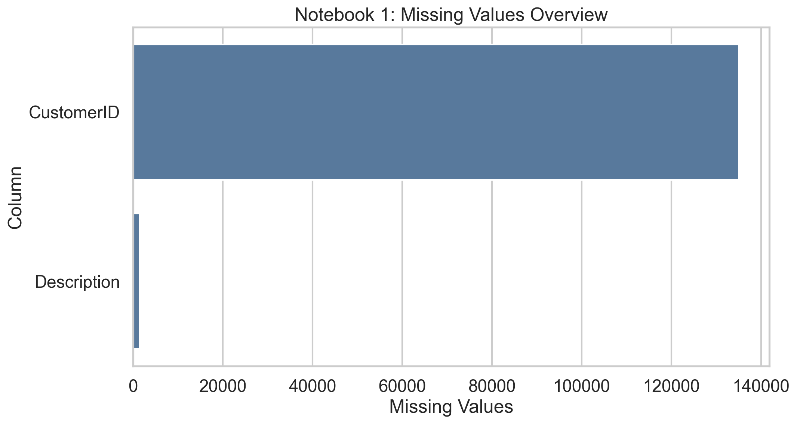
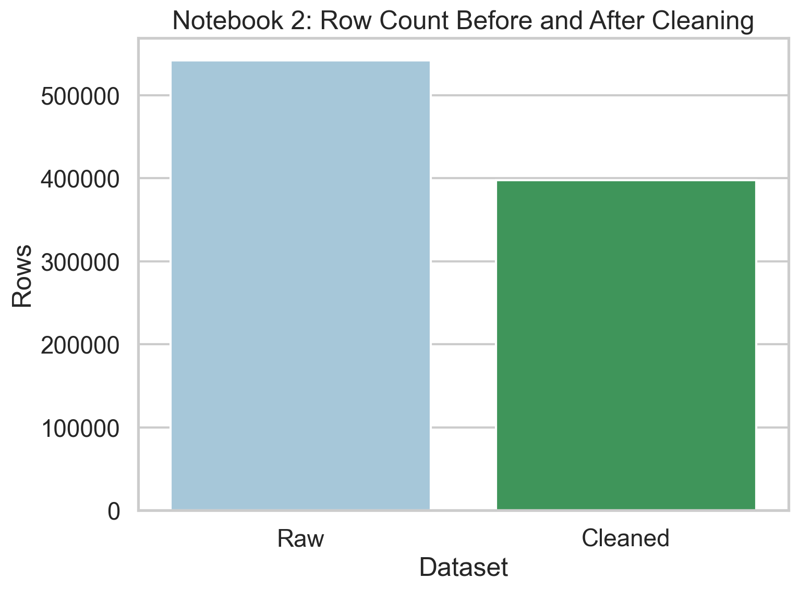
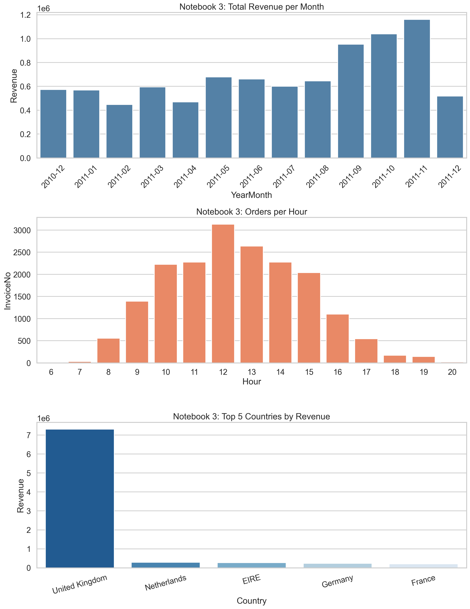
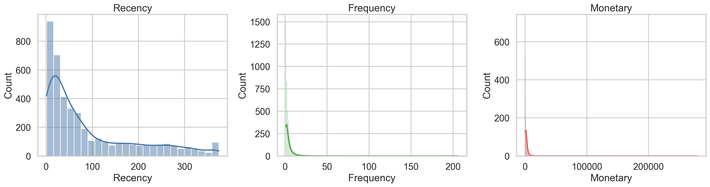

# Retail Intelligence Dashboard

Retail Intelligence is a customer segmentation project built from the Online Retail dataset.

The goal is to turn raw transaction data into clear business insights. The notebooks clean the data, explore sales patterns, build RFM features, and cluster customers into groups. The Streamlit app then turns those segments into a simple dashboard for understanding customer value and exporting cohorts for marketing use.

## Project Goal

This project answers questions like:

- Who are the most valuable customers?
- Which customers are likely to return or churn?
- How do revenue, frequency, and tenure differ across segments?
- Which groups should marketing target first?

## How It Works

1. `notebooks/01_data_understanding.ipynb` reviews the raw dataset and checks data quality.
2. `notebooks/02_data_cleaning.ipynb` removes invalid records and prepares the processed file.
3. `notebooks/03_eda.ipynb` explores revenue patterns, timing, and top-performing markets.
4. `notebooks/04_customer_segmentation.ipynb` builds RFM features and clusters customers.
5. `app.py` presents the final customer segments in an interactive Streamlit dashboard.

## What You Will See

- A high-level dashboard with customer counts, revenue, AOV, and tenure.
- Segment summaries that describe each customer group in business terms.
- Charts that compare segment distribution and customer behavior.
- Export options for downloading a selected customer cohort.

## Screenshots

### Streamlit Dashboard


### Notebook 1: Data Understanding



### Notebook 2: Data Cleaning



### Notebook 3: EDA



### Notebook 4: Customer Segmentation



## Run Locally

Use the commands below if you want to explore the project yourself.

```bash
pip install -r requirements.txt
streamlit run app.py
```

## Notes

- The dashboard reads from `data/processed/customer_segments.csv`.
- The images in this README render on GitHub because they are stored inside the repository.
- If you regenerate charts, keep the same filenames or update the image links here.

